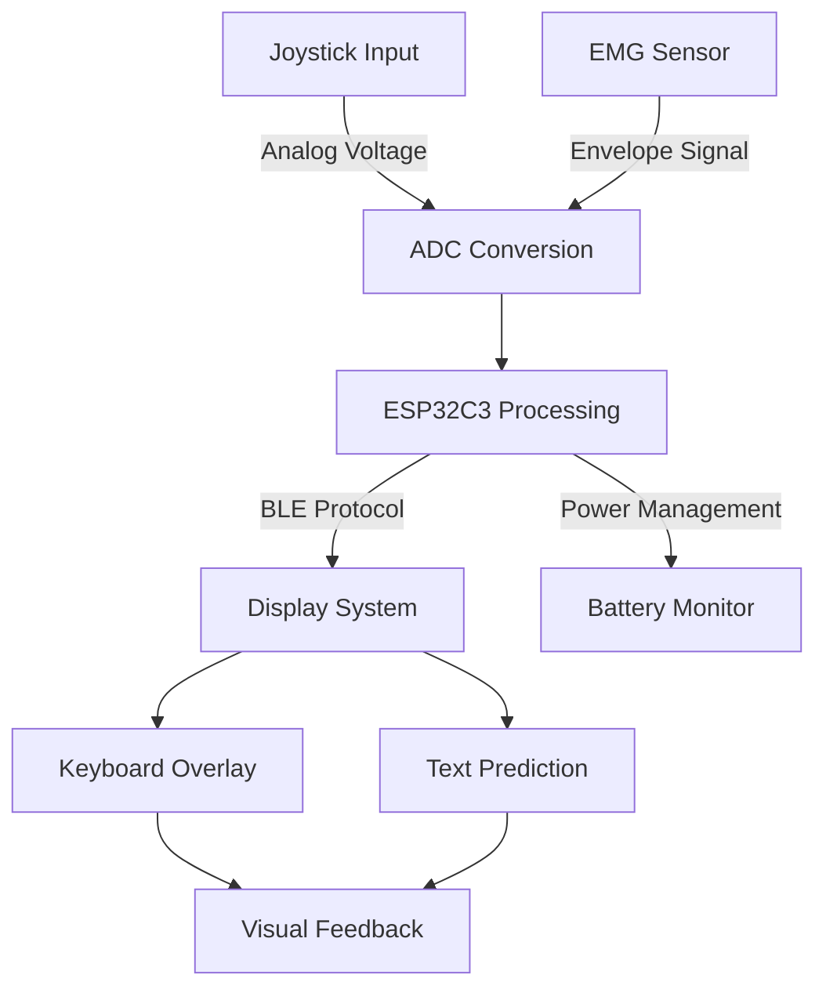

# Exotype: Intraoral Assistive Speech Device with AR Interface

## Project Overview
Exotype is an assistive speech wearable device combining an intraoral interface with AR-enhanced visual feedback for individuals with severe speech disabilities. This system enables intuitive text input through tongue movements and EMG-based bite detection. This was developed at Founders Inc (San Francisco) as part of the University Residency Program.

Thank you to Merge Grants and 1517's Medici Project for supporting this project!

*This project is still being developed. All files may not be up to date.*

## Demo & Hardware
<div align="center">
  <table>
    <tr>
      <td align="center" width="50%">
        <a href="https://www.youtube.com/watch?v=Htn9Xucbk8k">
          
        </a>
        <br>
        <em>Project Demo Video</em>
      </td>
      <td align="center" width="50%">
        
        <br>
        <em>Exotype Prototype</em>
      </td>
    </tr>
  </table>
</div>


## Technical Specifications

### Intraoral Interface
- Input Mechanism: Analog thumbstick (Adafruit SWITCH THUMBSTICK PUCK #2765)
  - Dual 10kΩ potentiometer configuration
  - Self-centering mechanism
  - Dimensions: 17.5mm × 17.4mm × 12.0mm
  - X/Y axis voltage output proportional to deflection

### EMG Bite Detection
- Sensor: MyoWare® 2.0 Muscle Sensor
  - Operating Voltage: 2.27V-5.47V (typical 3.3V-5V)
  - Input Bias Current: 250pA (max 1nA)
  - Form Factor: 37.57mm × 35.90mm
  - Triple output modes: Raw EMG/Rectified/Envelope
  - Cheek-mounted electrode configuration
  - Adjustable gain for sensitivity tuning

### Microcontroller System
- Platform: Seeed Studio XIAO ESP32C3
  - Built-in ADC for potentiometer signal processing
  - Bluetooth connectivity for AR glasses interface
  - Power Management:
    - 3.7V LiPo battery configuration
    - Step-up converter

### Visual Interface
- Display: VUF-110 Wearable Display
  - Physical Display: 0.195"
  - Virtual Screen: 4" at 12" viewing distance
  - Resolution: 720p HDMI input
  - Refresh Rate: 60Hz
  - Power: Internal battery (90-minute runtime)
  - Charging: 5V Micro USB
  - Mounting: Magnetic docking system

## PCB Design Specifications
Custom flexible PCB design optimized for intraoral placement:
- Manufacturer Specifications:
  - Single layer polyimide flex construction
  - Thickness: 0.13mm
  - Dimensions: 250mm × 62mm
  - Copper Weight: 0.5oz (18μm)
  - Surface Finish: ENIG (2U")
  - Track/Spacing: ≥0.06mm
  - Minimum Hole Size: ≥φ0.15/0.35mm
  - Coverlay: Black with white silkscreen

<table>
  <tr>
    <td align="center" width="50%">
      
      <br>
      <em>PCB Schematic</em>
    </td>
    <td align="center" width="50%">
      
      <br>
      <em>PCB Layout</em>
    </td>
  </tr>
</table>

## System Architecture & Operation Cycle

### Signal Flow & Processing Pipeline

#### 1. Input Acquisition

**Joystick Processing:**
- Dual 10kΩ potentiometers generate analog voltage signals (0-3.3V) corresponding to X/Y positions
- ESP32C3's integrated 12-bit ADC samples each axis:
  - ADC1 Channel 0: X-axis position
  - ADC1 Channel 1: Y-axis position
- Sampling rate: 100Hz per channel
- Resolution: 4096 discrete positions (12-bit)
- Built-in voltage reference for stable measurements

**EMG Signal Processing:**
- MyoWare 2.0 sensor captures muscle activation during bite events
- Rectified EMG signal processed through envelope detection
- Analog output fed into ESP32C3 ADC Channel 2
- Signal conditioning:
  - Hardware gain adjustment on MyoWare board
  - Digital threshold filtering for bite detection
  - Debouncing to prevent false triggers

#### 2. Power Management
- 3.7V 500mAh LiPo battery
- Voltage monitoring via ESP32C3 ADC
- Power distribution:
  - ESP32C3: 3.3V operating voltage
  - Joystick potentiometers: 3.3V reference
  - EMG sensor: 3.3V regulated supply

#### 3. Data Processing & Communication

**Microcontroller Operations:**
- ESP32C3 core functions:
  - ADC sampling management
  - Digital filtering of input signals
  - Coordinate mapping for cursor position
  - Bluetooth packet formation and transmission
  - Power state management

**Bluetooth Communication Protocol:**
- BLE 5.0 implementation
- Custom GATT service for device communication
- Packet structure:
```
{
  timestamp: uint32,
  x_pos: uint12,
  y_pos: uint12,
  bite_state: bool,
  battery_level: uint8
}
```
- Transmission rate: 50Hz
- Error checking and packet validation
- Auto-reconnection handling

#### 4. Visual Interface System

**Display Processing:**
- HDMI signal generation (720p @ 60Hz)
- Virtual keyboard overlay:
  - Resolution: 1280x720
  - Dynamic keyboard layout adaptation
  - Visual feedback for cursor position
  - Character highlighting on hover

**Cursor Control System:**
- Non-linear acceleration mapping for precise control
- Coordinate transformation:
```
x_screen = f(x_joystick) * screen_width
y_screen = f(y_joystick) * screen_height
```
where f(x) implements smooth acceleration curve

#### 5. Text Input & Processing

**Selection System:**
- Character selection confirmation delay: 50ms
- Double-bite detection for special functions

**Text Prediction Engine:**
- N-gram based prediction model
- Personal dictionary integration
- Context-aware suggestions
- Update frequency: Real-time on character input

<p align="center">
  
  <br>
  <em>Keyboard display on AR Glasses</em>
</p>

### Data Flow Diagram


## Future Development Roadmap
1. Integration with Brilliant Labs' Frame AR glasses
2. Capacitive touch sensor implementation
3. Custom AR glasses development
4. Enhanced predictive text algorithms
5. Extended battery life optimizations

## Repository Structure
```
├── firmware/
│   ├── src/
│   │   ├── main.cpp
│   │   ├── mouse_control.py
│   │   └── test.py
│   └── platformio.ini
├── hardware/
│   ├── pcb/
│   │   ├── gerbers/
│   │   └── kicad_files/
│   └── ar-glasses/ (to be completed)
├── software/
    ├── t_complete.py
    └── t_keyboard.py

```
